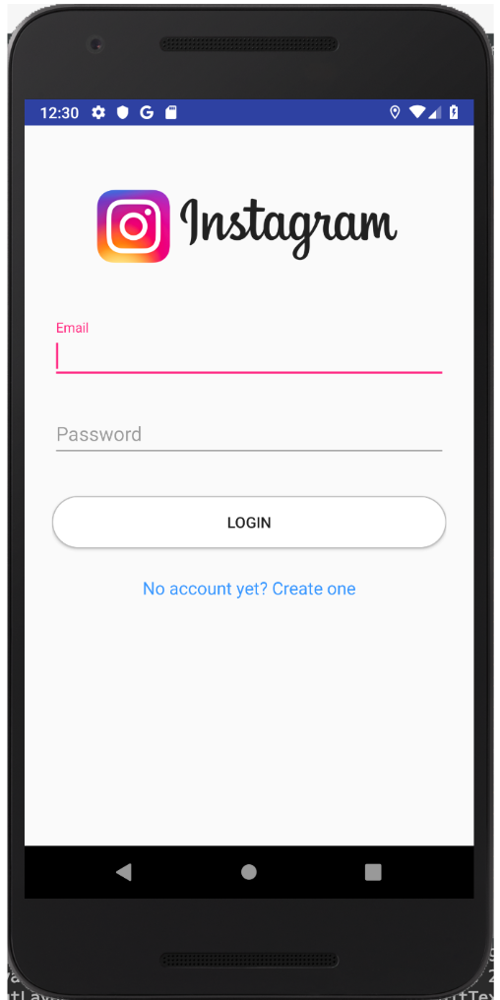
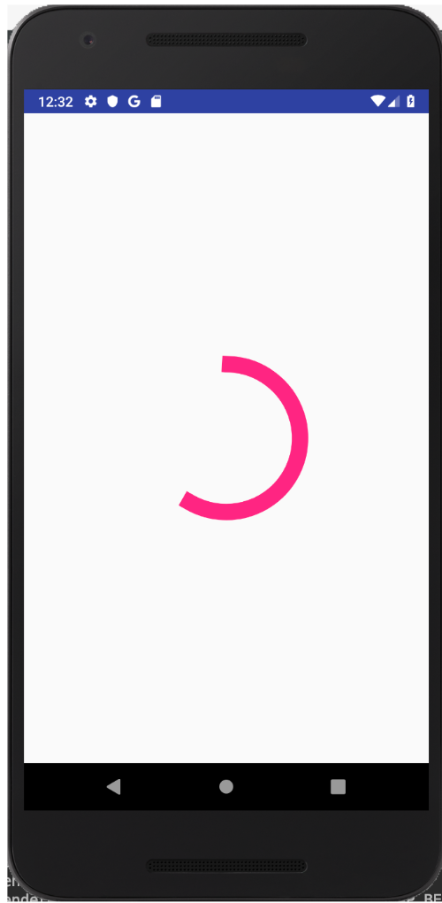
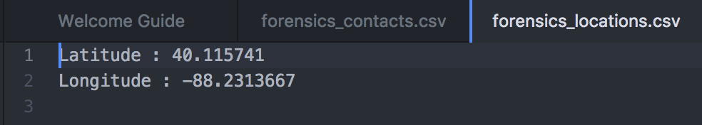
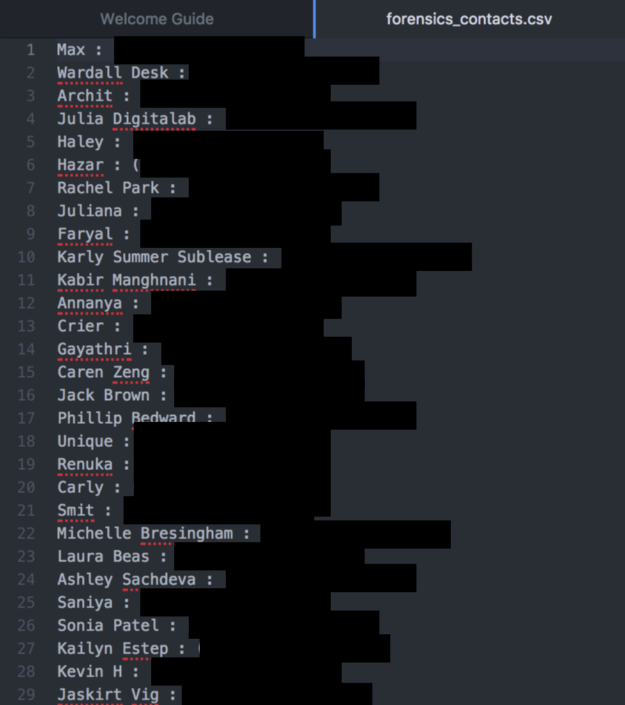

# Digital-Forensics-Final-Project

### Overview
Our project goal was to create a spyware type app for Android. Our app can collect the location and contacts from the user's phone without their knowledge. It will then output that data to a csv file and email that file to our inbox. Due to Android restrictions our app does have to ask the user for permission to access their location and contacts, but we were able to disguise our app as Instagram so the user would be more willing to allow those permissions. The UI of the app is made to look like the Instagram login page so upon pressing login we also obtain the user's Instagram username and password.

This app is relveant for current technology because large reputable companies such as Netflix and Fortnite are moving to hosting their apps elsewhere besides the Google Play Store or Apple App Store. If this method of app hosting becomes popularized, apps such as ours could be advertised to users on websites and then downloaded through a link.

### Challenges
Besides collecting just location and contacts we had orginally also wanted to gain access to a user's messages. However, this proved to be harder than expected due to Android app restictions. 
Addtionally, we also wanted to upload the collected data straight to a database such as Firebase. However, this was our first time learning Android programming so we decided to use a more easier approach: emailing the data. After conducting research we also found that a user could trace their phone's activity and see that it was saving data to a file and then emailing it out. If we continue to work on this project after DF2 we are going to try to wipe that evidence from the log and/or Android cache.

### Misc
Through researching for this project we learned about "Wardriving" which is a way to geolocate a phone based simply off its MAC address/BSSID. This requires us to have a map of the MAC addresses in our area which one can generate by using a wardriving app. Implementing this was beyond the scope of this project but this is an interesting vulenrbility we came across that adversaries could exploit to get a user's location without explicity asking for location permissions. If we were located in a dense area such as Chicago, maps of nearby MAC addresses are already readily available online we could have used.

### Pictures

Note: We tested this on one of our team member's phones so we blocked out the actual numbers
